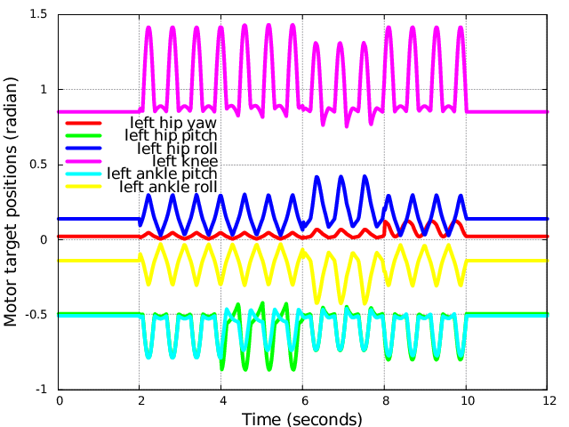
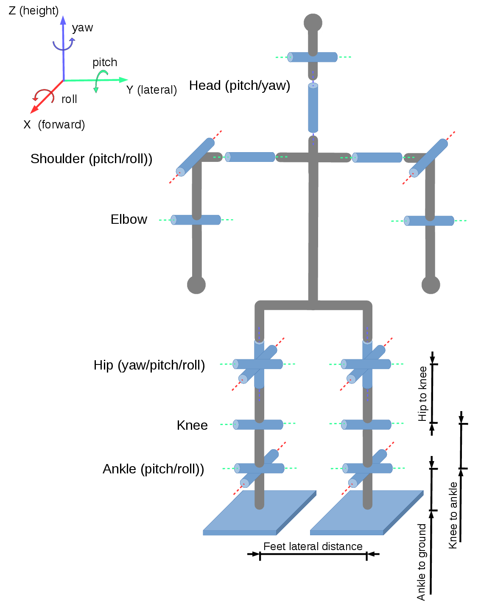

# IKWalk

The IKWalk library is a simple C++ implementation of an open loop walk engine 
for small and mid-size humanoid robots. Motor target positions are generated online 
based on splines in Cartesian space and inverse kinematics. No ZMP is used but
several parameters have to be manually tunned.

The walk engine allows for omnidirectional locomotion and was able to walk
on artificial grass at RoboCup 2015 Kid-Size competition in China.

The only dependency is the [linear algebra library Eigen3](http://eigen.tuxfamily.org)

## Documentation

* [How is it working](/Docs/engine.md)
* [Using the walk engine](/Docs/usage.md)
* [Walk engine parameters](/Docs/parameters.md)
* [Using the inverse kinematics](/Docs/kinematics.md)

## Example

Here is a simple example usage of the walk engine. 
A set of working parameters used during RoboCup 2015 on Sigmaban humanoid platform is exposed.
* [Example Code](/Example/example.cpp)

## License

IKWalk is under MIT License, please read the LICENSE file for further details.
Do not hesitate to fork this repository and customize it!

